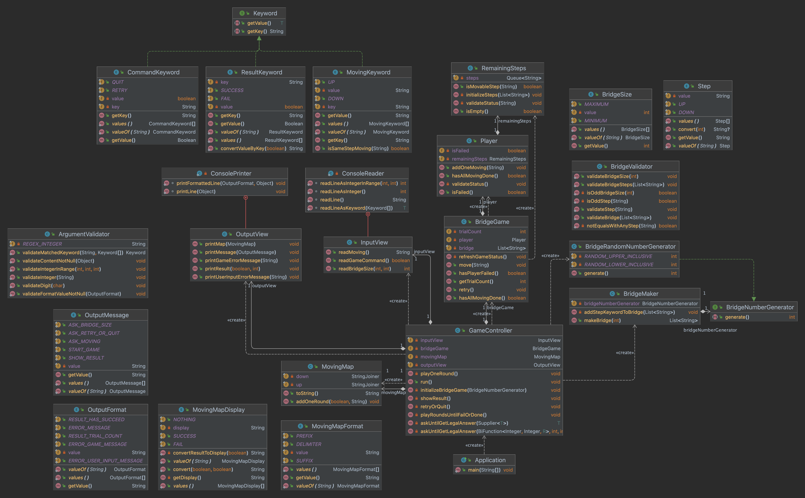

# [미션 - 다리 건너기] 명세서

## 목차

1. [기능 목록](#-기능-목록)
2. [상수값 목록](#-상수값-목록)
3. [단위 테스트 목록](#-단위테스트-목록)
4. [클래스 설계](#-클래스-설계)
5. [리팩토링 검토 목록](#%EF%B8%8F-리팩토링-검토-목록)

## 🚀 기능 목록

### 로직 분리에 따른 예외 발생 기준
  - `UI 로직`에서는 도메인 로직을 위한 조건을 모두 검증한 입력값을 받아 전달한다. (잘못된 입력값일 경우, 예외를 발생시킨 뒤 다시 입력값을 받는다.)
  - `도메인 로직`에서는 입력으로 전달받는 값은 모두 검증된 것으로 간주한다. 그러나 개발자의 실수 및 잘못된 메소드 사용에 대해 예외를 발생시킨다.
  - 예외 발생 시 적합한 표준예외를 사용한다.
  - 입력값 오류와 코딩 오류를 구분하기 위해 에러메시지에 `[ERROR] 게임 기능 오류:`, `[ERROR] 사용자 입력 오류:`와 같이 표기한다.

### 도메인 로직을 위한 기능

1.
    - [x] 무작위 값을 이용해 주어진 길이의 다리 정보를 생성하는 기능
      - [x] `예외발생` : 주어진 길이가 범위 밖의 수일 경우
      - [x] `예외발생` : bridgeNumber와 일치하는 다리 칸 정보가 없는 경우
2.
    - [x] 주어진 다리 정보를 이용해 건너야 할 다리 칸 정보를 순서대로 꺼낼 수 있게 생성하는 기능
      - [x] `예외발생` : 주어진 다리 정보가 null인 경우
      - [x] `예외발생` : 주어진 다리 정보의 길이가 범위 밖인 경우
      - [x] `예외발생` : 주어진 다리 정보에 지정된 키워드 외의 값이 저장된 경우
3.
    - [x] 현재 사용자가 건너야 할 칸 정보를 꺼낸 뒤 선택한 칸과 비교하여 성공 여부를 반환하는 기능
      - [x] `예외발생` : 더 이상 확인할 다리의 칸이 없는 경우
4.
    - [x] 사용자가 건너야 할 칸 정보와 상태를 갱신하는 기능
      - 선택한 칸에 대한 3번 기능의 결과에 따라 사용자의 게임 생존 상태를 갱신
      - [x] `예외발생` : 사용자가 이미 다리를 모두 건넜을 경우
      - [x] `예외발생` : 사용자가 이미 다리 건너기를 실패했을 경우
5.
    - [x] 재시도 시 사용자 상태(생존 여부)와 이동 현황 지도를 초기화, 시도 횟수는 증가시키는 기능
      - [x] `예외발생` : 재시도 횟수가 비정상적으로 증가한 경우 (int 범위 2,147,483,647에 도달한 경우)
6.
    - [x] 사용자의 상태, 남은 칸 수에 따라 게임 진행을 결정하는 기능
7.
    - [x] 입력받은 재시도/종료 결과에 따라 게임을 재시도/종료하는 기능

### UI 로직을 위한 기능

8.
   - [x] 다리의 길이를 입력받는 기능
     - [x] `예외발생` : 입력받은 값이 정수가 아닌 경우
     - [x] `예외발생` : 입력받은 값이 범위 밖의 수인 경우
9. 
    - [x] 사용자가 한 칸 이동에 성공하면 다음 이동할 칸을 입력받는 기능
      - [x] `예외발생` : 입력받은 값이 정해진 키워드 외의 값인 경우
10.
    - [x] 사용자가 실패하면 재시도/종료 여부를 입력받는 기능
      - [x] `예외발생` : 입력받은 값이 정해진 키워드 외의 값인 경우
11.
    - [x] 주어진 이동 현황을 형식에 맞게 출력하는 기능
      - 매 라운드마다 이동 현황 지도에 정보를 갱신
      - 이동 현황 정보에 저장된 키워드 상태에 대해서는 책임지지 않음.
      - [x] `예외발생` : 전달받은 이동 현황이 null인 경우
      - [x] `예외발생` : 전달받은 이동 현황이 비어 있는 경우
12.
    - [x] 게임 결과(게임 성공 여부, 총 시도한 횟수)를 형식에 맞게 출력하는 기능
13.
    - [x] 안내 메시지, 에러 메시지를 형식에 맞게 출력하는 기능
      - [x] `예외발생` : 출력할 메시지가 null인 경우
14.
    - [x] 잘못된 값 입력으로 인한 예외 발생 시, 에러 메시지 출력 후 그 부분부터 다시 입력받는 기능

## 🗄 상수값 목록

### 도메인 로직 정보
- [x] 다리 최소 길이, 최대 길이
- [x] 건널 수 있는 다리 칸 위치를 나타내는 키워드 `U` / `D`

### UI 로직 정보
- [x] 이동할 다리 칸 위치를 결정하는 키워드 `U` / `D` (도메인 로직과 별도)
- [x] 재시도/종료 여부를 결정하는 키워드 `R`/`Q`
- [x] 최종 결과의 성공/실패 여부를 표현하는 키워드 `성공` / `실패`
- [x] 다리 출력 형식
    - [x] 다리 시작을 나타내는 기호 `[`
    - [x] 다리 칸의 구분을 나타내는 기호 `|` (앞뒤 공백 포함)
    - [x] 다리 끝을 나타내는 기호 `]`
    - [x] 각 칸의 성공 여부를 나타내는 키워드 `O` / `X`
- [x] 메시지
    - [x] 게임 시작 메시지
    - [x] 입력 요청 메시지
    - [x] 결과 안내 메시지
- [x] 메시지 형식
    - [x] 오류 메시지 형식 `[ERROR]`
    - [x] 게임 성공 여부
    - [x] 총 시도한 횟수

## ✅ 단위테스트 목록

### 도메인 로직 단위테스트
- [x] 기능1 단위테스트
  - [x] 최소값, 최대값으로 다리 생성 테스트
  - [x] 주어진 길이가 범위 밖의 수이면 예외 발생
  - [x] bridgeNumber와 일치하는 다리 칸 정보가 없는 경우 예외 발생
- [x] 기능2 단위테스트
  - [x] 인자값 예외 테스트
    - [x] 주어진 다리 정보가 null인 경우 예외 발생
    - [x] 주어진 다리 정보의 길이가 범위 밖인 경우 예외 발생
    - [x] 주어진 다리 정보에 `U`, `D` 외의 값이 저장된 경우 예외 발생
- [x] 기능3 단위테스트
  - [x] 현재 선택한 칸의 성공 여부를 확인한 뒤 해당 칸 정보를 삭제
  - [x] 더 이상 확인할 다리의 칸이 없는 경우 예외 발생
- [x] 기능4 단위테스트
  - [x] 이동 결과에 따라 사용자 생존 상태 갱신
  - [x] 객체 상태 예외 테스트
    - [x] 사용자가 이미 다리를 모두 건넜을 경우 예외 발생
    - [x] 사용자가 이미 다리 건너기를 실패했을 경우 예외 발생
- [x] 기능5 단위테스트
  - [x] 재시도 시 사용자 상태 초기화, 시도 횟수 증가
- [x] 기능4, 기능11 연계 단위 테스트
  - [x] 이동한 다리 정보 형식을 변환해 이동 현황 지도에 저장

## 🖋 클래스 설계

### 기능 목록 작성 시 초기 설계안

### 기능 구현 완료 후 클래스 구조

### PR 전 최종 리팩토링 후 클래스 구조

## ♻️ 리팩토링 검토 목록
### 코드 스타일 및 요구사항
- [x] 인덴트 2 이하 검토
- [x] 메소드 분리 검토
- [x] 메소드 길이 10라인 이하 검토
- [x] 파라미터 개수 3개 이하 검토
- [x] 변수, 메소드 선언 순서 정리 (메소드 정렬 기준 1순위: 메소드 간 논리적 연관성, 2순위: public-private)
- [x] Java 코드 컨벤션 가이드 준수 검토
- [x] 요구사항에 주어진 클래스 적용 규칙 검토
- [x] TODO 주석 모두 해결 후 삭제
- [x] 클래스, 메소드 주석 작성 (메소드 주석은 `GameController`에만 추가)

### 클래스 분리 및 설계 관련
- [x] `BridgeGame`에서 직접 `BridgeMaker`를 생성하지 않고, 생성자로 전달받도록 하기 (다리 생성 책임 분리)
- [x] `Player`에서 직접 `RemainingSteps`를 생성하지 않고, 생성자로 전달받도록 하기 (다리 검증 책임 분리)
- [x] 딱 한 번 쓰이는 `ExpressionConverter` 클래스 삭제하고 `BridgeMaker`에서 해당 기능 수행하기
- [x] `MovingMap` 생성 로직 단순화
  - `Player`의 `movingHistory`를 이용하지 않고, `GameController`에서 매 라운드의 게임 결과에 따라 이동 현황 지도를 갱신 및 초기화하는 방식으로 변경함.
    - `MovingMap`은 뷰 템플릿으로써 `GameController`에서 `OutputView`으로 전달됨.
    - `OutputView`가 전달받은 `MovingMap`을 바로 출력하도록 함. (toString 오버라이딩)
    - 이에 따라 `Player`, `BridgeGame`에서 `movingHistory` 필드 및 관련 메소드 삭제함.
- [x] 입력 값에 대하여 도메인 로직 조건 검증 시 도메인 클래스 참조하는 문제 해결하기
- [x] `ConsolePrinter`, `ConsoleReader`를 `OutputView`, `InputView`의 정적 내부 클래스로 변경(요구사항 고려, 메모리 낭비 방지 및 은닉화)
- [x] 입출력 값 검증 로직을 모두 `ArgumentValidator`로 분리하기
- [x] 에러 메시지에 추가한 `사용자 입력 오류:`, `게임 기능 오류:` 형식을 출력 위치에 따라 자동으로 적용시키기 (출력 시 오류는 기능 오류에 포함됨)
- [x] `OutputView`의 변환 로직을 성공/실패 키워드를 저장하는 `ResultKeyword`로 분리
- [x] `BridgeMaker`의 변환 로직을 다리 칸 위치 도메인 키워드를 저장하는 `Step`로 분리
- [x] `MovingMapGenerator`의 변환 로직, 판별 로직을 `MovingDisplay`, `MovingKeyword`로 분리
- [x] 에러메시지는 각 예외를 발생시키는 `BridgeValidator`, `ArgumentValidator` 클래스에서 한 번에 볼 수 있기 때문에 별도 상수 클래스로 분리하지 않기로 함.

### 테스트 관련
- [x] 생각하지 못한 예외 사항 직접 프로그램 실행해보면서 검토
- [x] 추가 예외 사항에 대한 단위 테스트, 기능 테스트 작성
    - [x] 재시도 시 이동 현황 지도 초기화 테스트
    - [x] 이동 현황 지도 갱신 테스트
- [x] 테스트 코드 리팩토링